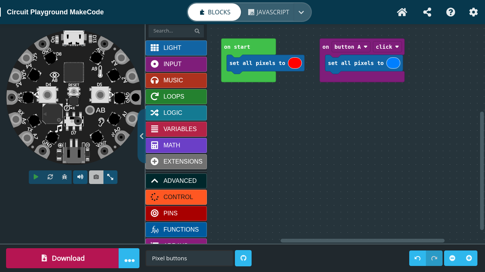
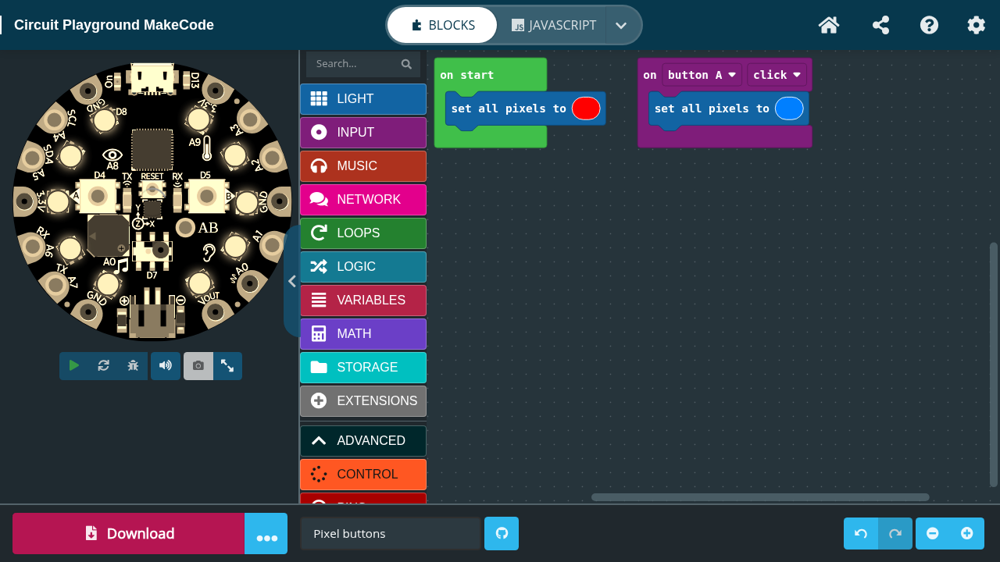

# Circuit Playground MakeCode

This project builds and hosts one modern, self-contained MakeCode editor for
both Adafruit Circuit Playground boards:

- Circuit Playground Express (CPX, SAMD21)
- Circuit Playground Bluefruit (CPB, nRF52840)

**Try the live editor: [makecode.jim.sh](https://makecode.jim.sh/)**

| Circuit Playground Bluefruit | Circuit Playground Express |
| --- | --- |
|  |  |

## Why this exists

Adafruit's original [Circuit Playground MakeCode
editor](https://makecode.adafruit.com/) focuses on the Circuit Playground
Express. Microsoft's [MakeCode Maker editor](https://maker.makecode.com/) also
has Circuit Playground board definitions, including Bluefruit support.
However, both sites use relatively old MakeCode stacks, and the Maker editor's
Circuit Playground support in particular has substantial bugs.

We wanted one maintained site where projects can move between CPX and CPB
without losing source, where built-in compilation and simulation work without
Microsoft cloud services, and where both boards share a polished,
Circuit-Playground-specific interface.

The hosted editor includes self-hosted immutable share links. Normal editor
sessions make no telemetry or other implicit third-party requests; GitHub and
external packages are optional, user-initiated features.

## Repository layout

This orchestration repository coordinates four independently versioned source
repositories:

| Directory | Purpose |
| --- | --- |
| `pxt/` | Source-built fork of the MakeCode/PXT framework |
| `pxt-circuit-playground/` | Circuit Playground target, blocks, simulator, documentation, and web package |
| `codal-circuit-playground-bluefruit/` | Circuit Playground Bluefruit CODAL runtime |
| `Adafruit_nRF52_Bootloader/` | Bluefruit UF2/DFU bootloader and HF2 WebUSB support |

Each source repository retains an `upstream` remote so fixes can be compared
with and contributed back to the original project. See [STATUS.md](STATUS.md)
for the implementation state, reproducible baselines, test results, and
remaining hardware acceptance work.

## Building and testing

The top-level Makefile runs the editor and native toolchains in pinned
containers. A typical editor build is:

```sh
make pxt-install
make pxt-check
make pxt-serve
```

The complete native and release gates are:

```sh
make codal-check
make codal-build
make bootloader-check
make bootloader-build
make static-build
make static-firefox-check
```

`static-build` produces a versioned, read-only container and runs the full
Chrome browser acceptance suite. The Firefox gate additionally tests offline
project export/import and validates downloaded CPX and CPB UF2 files. Release
artifacts are written beneath `artifacts/`, which is intentionally not tracked
by Git.

Deployment uses the static package baked into the container; it does not
mount a source checkout over the application. See
[deployment/README.md](deployment/README.md) for the service layout, share-data
backup procedure, and rollback process.

## Project status

The editor and self-hosted sharing service are deployed as an alpha. Automated
Chrome and Firefox acceptance is extensive, but physical-board validation is
still required for CPB WebUSB flashing, bootloader recovery, speaker cold
boots, and the full peripheral matrix. Do not treat generated CPB bootloader
artifacts as hardware-proven releases yet.

This project is independently maintained and is not an official Adafruit or
Microsoft service. Microsoft MakeCode/PXT and the Adafruit-derived components
retain their respective upstream licenses and trademarks.
